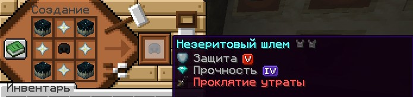

# Крафт куча супер вещей
## Супер Слиток
Чтобы сделать "Супер Слиток" необходимо собрать 9 шалкеров со стаками золотых слитков и поместить в верстак.

## Cупер меч
Чтобы скрафтить "Супер меч", необходимо поместить в верстак 8 "Супер Слитков" по кругу и в центральную ячейку поставить Любой меч. "Супер меч" имеет зачарование "Острота VII".
Если меч будет иметь другие зачарования, то при крафте они не сбрасываются. (кроме нерушимости).

## Зачарованное яблоко
Чтобы получить зачарованное яблоко необходимо:
- 4 золотых блока
- 4 алмазных блока
- 1 золотое яблоко

Поместить в верстак так, как изображено на картинке.

## Огненный шар для сбора спавнеров
Чтобы скрафтить огненный шар для добычи спавнеров, необходимо 4 динамита и 5 обычных огненных шаров.
Поместить в верстак так, как показано на картинке. Работает только на 3-4 анархиях.

## Защита V
Чтобы скрафтить защиту V (5), необходимо 4 звезды незера и любой вид брони.
Поместить в верстак так, как показано на картинке.
Если броня будет зачарованной другими зачарованиями, то все чары при крафте не сбрасываются. (кроме нерушимости).

## Ядерный ТНТ
Чтобы скрафтить "Ядерный TNT", необходимо 4 блока песка, 4 пороха и 1 Cупер Порох (крафт супер пороха идентичен крафту "Cупер Cлиток").
Поместить в верстак так, как показано на картинке.

