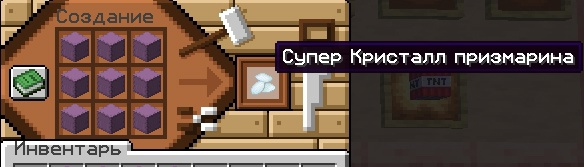

# Крафт куча супер вещей
## Супер Слиток
Чтобы сделать "Супер Слиток" необходимо собрать 9 шалкеров со стаками золотых слитков и поместить в верстак.

## Cупер меч
Чтобы скрафтить "Супер меч", необходимо поместить в верстак 8 "Супер Слитков" по кругу и в центральную ячейку поставить Любой меч. "Супер меч" имеет зачарование "Острота VII".
Если меч будет иметь другие зачарования, то при крафте они не сбрасываются. (кроме нерушимости).

## Зачарованное яблоко
Чтобы получить зачарованное яблоко необходимо:
- 4 золотых блока
- 4 алмазных блока
- 1 золотое яблоко

Поместить в верстак так, как изображено на картинке.

