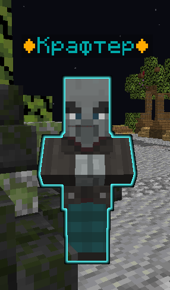

# ` Осколки спавнеров `
## _`Осколки спавнеров можно найти как и в мистических сундуках, как и в ванильных структурах`_
 # Что можно получить с кейсов с спавнерами:
- опытные
- опытные 2
- опытные 3
- конные
- шашлычёк
- насекомые
- ползуны
- монстры сокровищни
- домашние животные
- костолом
- страх шахтера
- всё или ничего
- человекоподобные
- беззащитные
- тупые
- `Адские монстры`
 # ` Сам NPC выглядит так:`
 
 # `При нажатии правой кнопкой мыши по крафтеру,будут следущие предложения:`
 
 

